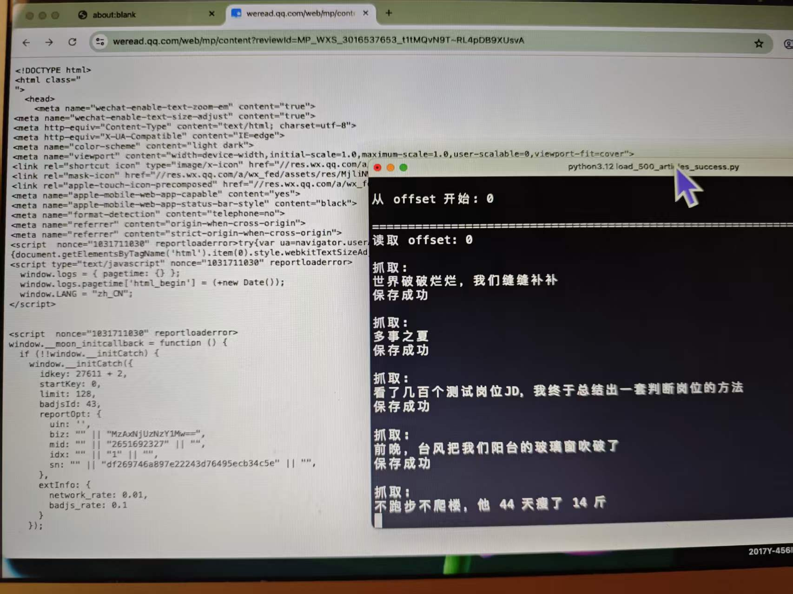

# 微信读书公众号历史文章批量归档工具

基于 Python + Playwright 开发的微信公众号历史文章自动化归档工具。

该工具通过自动化浏览器操作获取微信读书中的公众号历史文章列表，并批量提取文章正文内容，转换为 Markdown 格式保存，方便后续阅读、检索和知识整理。

---

## 项目背景

微信公众号长期沉淀了大量有价值的信息，但随着文章数量增加：

- 查找历史文章效率较低；
- 不方便批量整理和分析；
- 手动保存成本较高。

因此开发该工具，实现公众号历史文章的自动化获取和本地归档。

---

## 功能特点

### 1. 浏览器自动化

使用 Playwright 控制 Chrome 浏览器：

- 保留用户登录状态；
- 自动访问微信读书页面；
- 自动获取文章列表；
- 自动提取文章正文。

### 2. 批量文章下载

支持：

- 获取公众号历史文章列表；
- 自动遍历文章；
- 批量保存文章内容。

### 3. Markdown 格式归档

每篇文章自动生成独立 Markdown 文件：

```
文章标题.md
```

文件格式：

```
# 文章标题

时间：发布时间

---

文章正文
```

方便后续：

- 本地阅读；
- 知识库整理；
- AI 工具分析。

### 4. 断点续传

通过 `progress.json` 保存下载进度。

示例：

```json
{
  "offset": 200
}
```

程序异常退出后，可以从上一次进度继续运行，避免重复下载。

### 5. 异常处理

包含：

- 登录状态检测；
- JSON 解析异常处理；
- 单篇文章失败跳过；
- 已存在文件自动跳过。

---

## 技术栈

| 技术 | 用途 |
| ---- | ---- |
| Python | 主开发语言 |
| Playwright | 浏览器自动化 |
| BeautifulSoup | HTML 内容解析 |
| JSON | 下载进度管理 |
| Regex | 文本提取和清理 |
| Markdown | 内容归档格式 |

---

## 项目结构

```
wechat_reader_downloader_project

├── README.md                         # 项目说明
├── requirements.txt                  # Python依赖
├── .gitignore                        # Git忽略文件配置
│
├── wechat_chrome_profile/            # Playwright Chrome用户数据目录
│   └── .gitkeep
│
└── wechat_reader_downloader/          # 主程序目录
    │
    ├── wechat_reader_downloader.py    # 主程序
    │
    └── output_articles/               # 下载后的文章目录
        └── .gitkeep

```

### 关于 wechat_chrome_profile

该目录用于保存 Playwright 启动 Chrome 时的用户数据。

项目采用 Playwright 的 `launch_persistent_context` 模式，通过保存浏览器用户数据保持微信读书登录状态。

首次运行时需要完成微信读书登录，登录信息会保存在该目录中。

后续运行可以复用已有登录状态，避免重复登录。

---

## 环境要求

- Python 3.9+
- Google Chrome
- Playwright

---

## 安装依赖

安装 Python 依赖：

```bash
pip install -r requirements.txt
```

安装 Playwright 浏览器：

```bash
playwright install
```

---

## 使用方法

### 1. 配置 Chrome 用户目录

修改：

```python
PROFILE_DIR
```

设置为本地 Chrome 用户数据目录。

示例：

```python
PROFILE_DIR = "/your/path/chrome_profile"
```

---

### 2. 配置文章来源

修改：

```python
BOOK_ID
```

设置目标公众号对应 ID。

---

### 3. 运行程序

执行：

```bash
python main.py
```

首次运行：

1. 程序打开 Chrome 浏览器；
2. 用户完成微信读书登录；
3. 返回终端按回车；
4. 程序开始自动下载文章。

---

## 输出示例

运行后：

```
output_articles/

├── 文章1.md
├── 文章2.md
├── 文章3.md
└── progress.json
```

---

## 项目收获

通过该项目实践：

- Python 自动化脚本开发；
- Playwright 浏览器自动化；
- HTML 内容解析；
- 批量文件处理；
- 程序状态保存与恢复。

---

## 后续优化方向

- 增加文章图片资源下载；
- 增加 SQLite 数据库存储；
- 增加文章搜索功能；
- 自动生成文章摘要；
- 结合 AI 进行文章分析。

---

## License

MIT License

---

## Demo


